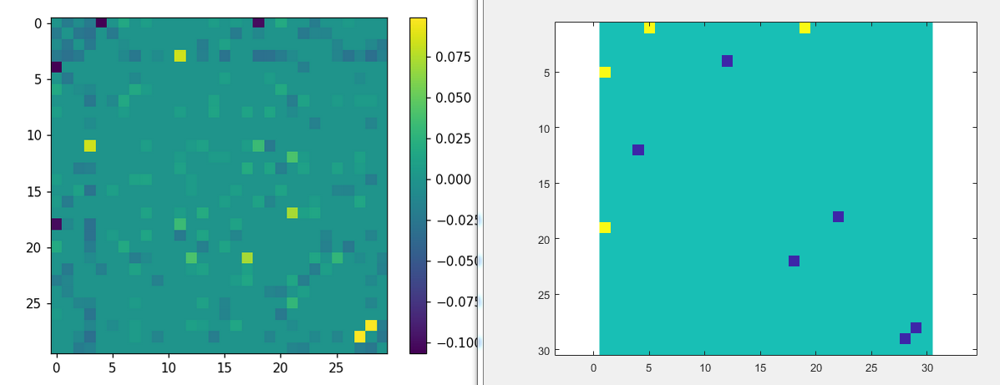

# Finding Higher Order Interaction with Efficient Sampling.

This is a simulation to show that compressed sensing based approach can infer higher order interactions of the features in the data. Demonstrating this is useful to show that we can indeed use this approach for perturbing nonlinear systems and have a hope to recover underlying interactions between features in the data.

I have generated a synthetic dataset with P number of features with two-way or three-way couplings between sparse number of features. Then trained simple neural network to do regression as a forward model. Predicted higher order couplings with ~log(P^2) perturbations of the input features of the neural network.

This approach could be useful for high-throughput drug or gene signaling molecule screening.

#
*It's been tested using Pyhton 3.7 and Matlab2017b.*